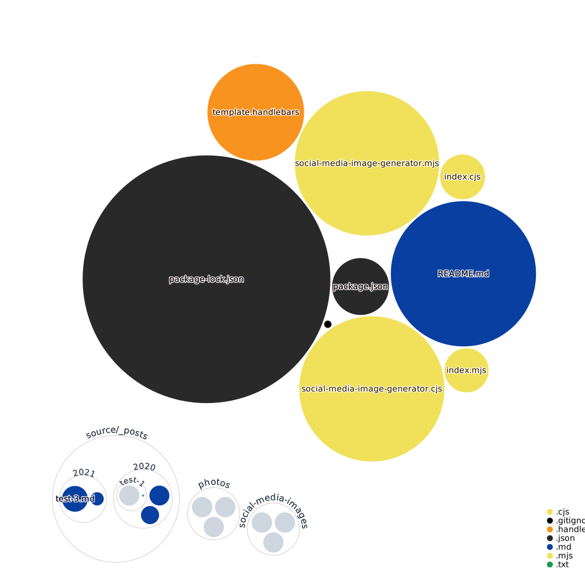

# social-media-image-generator

If you run a website generated by a SSG (Static Site Generator like [hexo](https://hexo.io/), which supports Frontmatter, and want to generate social media images out of your post images, then this script is for you.

Read more on [kiko.io - Generate Social Media Images Automatically](https://kiko.io/post/Generate-Social-Media-Images-Automatically/)...

[](https://github.com/kristofzerbe/social-media-image-generator/blob/main/package.json)
[](https://github.com/kristofzerbe/social-media-image-generator/issues)

There are **two versions** of the script: one is realized as an **ES Module** (``.mjs``) and the other with **CommonJS** (``mjs``).

# Prerequisites

You will need [node.js](https://nodejs.org/en/) 14 or higher, because the MJS script is realized as an ES module.
# Installation

This script depends on 5 NPM packages, you need to install:

* [npm install --save front-matter](https://www.npmjs.com/package/front-matter) - Parsing your posts Front-Matter
* [npm install --save handlebars](https://www.npmjs.com/package/handlebars) - Templating for the temporary HTML file
* [npm install --save puppeteer](https://www.npmjs.com/package/puppeteer) - Generates screenshot from temporary HTML file via headless Chromium
* [npm install --save imagemin](https://www.npmjs.com/package/imagemin) - Optimize output PNG file
* [npm install --save imagemin-pngquant](https://www.npmjs.com/package/imagemin-pngquant) - Plugin fpr imagemin

**Important:** ``imagemin`` in the latest version 8.0.0 contains an ES Module only and therefore the CommonJS won't run. **This is why both scripts use version 7.0.1!**

The script itself needs no installation. Just store it in your project where you want.

## Setup

### Post Frontmatter

The Frontmatter of each post, has to have at least 3 entries:

* ``title`` - Title of the post
* ``subtitle`` - Subtitle of the post (optonal; can be empty)
* ``photograph.file`` - Filename (only) of the image related to this post

```md
---
title: 'Test 2'
subtitle: 'A simple Subtitle'
photograph:
  file: DSC_9368.jpg
---
```

### Photograph Folder

All you photographs have to be stored in one specific folder, where the script is looking for the given ``photograph.file`` out of the posts Frontmatter.

## Run the script

In the repository you will find an ``index.mjs`` (or ``.cjs``), which executes the generation script ``social-media-image-generator.mjs`` (or ``.cjs``) via node.js in the console. The generator has 4 parameters:

1. postFolder - Folder with your posts MD files
2. photoFolder - Folder with your photographs
3. templateFile - HTML template file, with variables for Handlebars
4. targetFolder - Folder to store the generated social media images

The ``postFolder`` is processed recursively, so you can have much subfolders with MD files as you want.

For example:
```js
node index.mjs "./source/_posts" "./photos" "./template.handlebars" "./social-media-images"
```

or:
```js
node index.cjs "./source/_posts" "./photos" "./template.handlebars" "./social-media-images"
```

Only those posts with be processed, which have an existing ``photograph.file`` defined in the Frontmatter and if the corresponding social media file is not existing.

## Hexo integration

If you run your blog with Hexo, you can integrate the script into the generation pipeline.

First, copy ``social-media-image-generator.cjs`` into a new folder called ``lib`` or something like that. Don't use the existing ``scripts`` folder, because Hexo's will run all scripts in this folder automatically.

Create a new ``on-ready-generate-social-media-images.js`` in the above mentioned ``scripts`` folder, to trigger the social media script at the start at the pipeline:

```js
const log = require('hexo-log')({
    debug: false,
    silent: false
});

const Generator = require("../lib/social-media-image-generator.cjs").Generator;

hexo.on("ready", function() {
    
    log.info("Running Social-Media-Image-Generator...");

    const postFolder = "../source/_posts";
    const photoFolder = "../photos";
    const templateFile = "../template.handlebars";
    const targetFolder = "../social-media-images";

    const generator = new Generator(postFolder, photoFolder, templateFile, targetFolder);
    generator.generate();

});
```

Customize the values of the 4 parameter values to your needs or take it from your config by using ``hexo.config.<your-entry>``

## Contributing

Yes, please ... fork the project, make your changes and submit pull requests against the main branch.

## History

**1.0.0**
- Initial version

## License

**MIT** : http://opensource.org/licenses/MIT

## Codebase Vizualization
For an inactive diagram, please visit [Repo Visualization App](https://octo-repo-visualization.vercel.app/?repo=kristofzerbe%2Fsocial-media-image-generator)...

